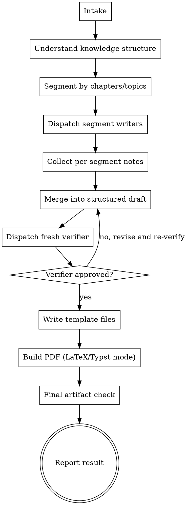

# NovaForge — 通用知识笔记模板

将任意学科/项目的知识体系整理为结构化笔记。支持 LaTeX（编译为精美 PDF）和 Markdown（快速记录）双版本模板，适用于考研、考公、专业课学习、科研研究、项目总结、竞赛准备等场景。

**核心理念：** 先理解知识体系 → 按模块组织 → 生成含概念+原理+方法+案例+实战+练习+复盘的完整笔记。

## Non-Negotiables

- 支持三种输出格式，用 AskUserQuestion 让用户选择（如果用户没明确说用哪个）：**LaTeX**（编译 PDF，默认）、**Typst**（编译 PDF，语法更现代）、**Markdown**（纯文本即时记录）。
- 支持六种模板模式，Intake 时按以下规则处理：
  - **用户已明确指定类型**（如"期末速成""考研笔记""整理文献""项目总结"）→ 直接推断模式，不弹出模式选择
  - **用户说法模糊**（如"帮我整理笔记""做份复习资料"）→ 根据学科/上下文给出 2~4 个相关选项供选择，不要全部列出
  - 六种可用模式：
    - **章节笔记模式**（7 步结构）：系统学习新知识，每节 7 步
    - **期末复习模式**（真题分类）：备考冲刺，真题+留白练习
    - **考研模式**（7 步 + 考研真题）：考研专业课，院校真题标注
    - **考公模式**（考点分类）：行测/申论/面试备考
    - **科研模式**（文献+笔记+方法）：文献整理与研究笔记
    - **项目模式**（项目文档）：架构/进度/决策/复盘
- 期末复习模式下，练习必须**留空**（不给出答案），答案统一在文末"习题答案与提示"一节给出。
- 科研模式下，输出专注于文献总结、方法归纳和与自身研究的关联分析。
- 默认输出路径：在当前工作目录下创建 `NovaForge-Output-<project-name>/` 文件夹，所有文件放入其中。
- 默认编译方式：LaTeX 模式 `xelatex` × 2 遍，Typst 模式 `typst compile` 单次编译。
- 知识点旁如能用图片更直观、更易理解的，必须加入图片（LaTeX 用 tikz 绘制，Typst 用 cetz 或内置绘图，Markdown 用链接/嵌入）。图片应是简洁的概念性图示，而非装饰性插图。
- **日期格式规则：** 所有资料（考研/考公/竞赛/期末/专业课）的最终修订日期必须使用中文完整格式 `YYYY年M月D日`（如 `2026年5月14日`），不可省略年、月、日中的任何部分，不可使用斜杠格式。除非用户明确要求修改，否则必须遵守此格式。
- **知识要点覆盖规则：** 所有知识点**至少必须提及**，不能跳过一个主题完全不写。深度按重要性分档：**重点知识详细展开**（定义、公式、原理、易错点、适用条件等），**边缘知识简要带过**（一两句话说明是什么即可）。核心原则：广度优先、深度按需。用户可随时要求进一步精简或补充。
- 当此 skill 被触发时，仅输出文字聊天不算完成，必须生成文件并确认写入磁盘。

## Required Outcome

默认成功结果：

- LaTeX 模式：保存 `.tex` 源文件 + 编译后的 `.pdf`
- Typst 模式：保存 `.typ` 源文件 + 编译后的 `.pdf`
- Markdown 模式：保存 `.md` 文件
- 所有生成文件放入 `NovaForge-Output-<project-name>/` 文件夹
- 最终回复报告生成的文件路径

以下情况**不算**完成（除非用户明确要求）：

- 仅文字聊天回复
- 草稿未写入磁盘
- 声称完成但未确认文件实际存在

## When to Use

当用户需要以下场景时使用此 skill：

- "帮我整理 **XX** 的笔记"
- "做一份 **XX** 的复习资料"
- "用 NovaForge 模板"
- "整理成 7 步结构笔记"
- 考研 / 考公 / 专业课的知识体系整理
- 科研笔记 / 项目总结 / 竞赛准备
- 文献整理 / 论文笔记 / 研究方向综述
- 项目文档 / 实验记录 / 技术方案整理

Common trigger phrases：
- 整理笔记
- 复习资料
- 知识总结
- 考前冲刺
- 7 步笔记
- 期末速成
- 期末复习
- 真题整理
- 整理文献
- 文献笔记
- 论文笔记
- 研究方向
- 科研笔记
- 项目总结
- 技术方案
- CNAO
- 天文奥赛
- 竞赛
- NovaForge

Do not use this skill for：

- 单纯总结课件 slides（使用 `summarize-slides`）
- 只编译已有 `.tex` 到 PDF（使用 `pdf`）
- 纯 PDF 操作（合并/拆分/加密/OCR 等，使用 `pdf`）
- 不需要生成文件，只问问题

## Skill Boundary

- Allowed skills for this workflow：`NovaForge` and `pdf` only.
- Forbidden：all other skills.

## Workflow Model

- `controller`：负责确认需求、全局理解知识体系、分块规划、合并、生成模板文件、编译、最终检查
- `segment-writer`：每个知识模块的独立写手
- `verifier`：检查覆盖完整性、结构是否完整、公式是否正确、内容是否准确

## Dispatch Rules

- 按知识体系的自然模块（章节笔记模式按教材章节，期末复习模式按考试题型，科研模式按文献/研究方向）分块
- 每块用对应的模板结构组织
- 各块之间独立时可并行派发 `segment-writer`
- 紧密关联的推导链不应拆分
- `verifier` 必须在合并后单独执行，不可复用 `segment-writer`

## Execution Flow



## Step 1. Intake

- 确认用户要整理什么学科/项目
- 确认用 LaTeX（编译 PDF，默认）、Typst（编译 PDF）还是 Markdown（纯文本）——用户没说则用 AskUserQuestion 弹出选择
- 确认输出路径（默认当前工作目录下的 `NovaForge-Output-<project-name>/`）
- 确认覆盖范围（全部内容还是指定章节）
- **确认模板模式**：
  - 用户已明确指定（如"期末速成""考研笔记""整理文献""项目总结"）→ 直接推断，无需询问
  - 用户说法模糊 → 根据上下文列出 2~4 个相关选项，用 AskUserQuestion 供选择，不要全部列出
- 记录用户的风格要求

Default style：
- language：Chinese
- layout：single-column
- purpose：知识整理 / 考试复习 / 科研文献整理
- tone：清晰、结构化、不啰嗦
- output：`.tex` + `.pdf`（LaTeX 模式）、`.typ` + `.pdf`（Typst 模式）或 `.md`（Markdown 模式），放入 `NovaForge-Output-<project-name>/`

## Step 2. Check Build Environment

- LaTeX 模式：确认 `xelatex` 可用
- Typst 模式：确认 `typst` 可用（安装方式：`cargo install typst-cli` 或从 https://github.com/typst/typst/releases 下载）
- 如果 `xelatex`/`typst` 缺失但有 PDF 需求，报告环境问题

## Step 3. Understand Knowledge Structure

- 了解知识体系的宏观结构
- 章节笔记模式：按教材章节划分
- 期末复习模式：按考试题型/知识点划分（行列式、矩阵、方程组、特征值、二次型……）
- 考研模式：按教材章节划分，每节 7 步结构 + 考研真题标注 + 题型专项总结
- 考公模式：按考试科目/题型模块划分（行测文/理、申论、面试等）
- 科研模式：按文献/研究方向划分（单篇文献按内容逻辑，多篇文献按主题聚类）
- 项目模式：按项目阶段/功能模块划分（架构、前端、后端、部署等）
- 识别公式密集区、概念密集区、文献密集区
- 构建分块映射

## Step 4. Segment by Chapters/Topics

- 按教材章节或知识模块的自然边界分块
- 章节笔记模式：每块用 7 步结构
- 期末复习模式：每块按题型组织（考法→真题→方法→练习）
- 考研模式：每块用 7 步结构 + 考研真题(标注来源院校+年份) + 题型专项总结
- 考公模式：每块按考试题型组织（考点概述→核心方法→真题标注→练习→时政/规范链接）
- 科研模式：每块按文献内容逻辑组织（背景→方法→结果→创新→局限→关联）
- 项目模式：每块按项目阶段/功能模块组织（目标→架构→实现→进度→问题→复盘）
- 紧密关联的内容不应拆分

## Step 5. Segment Writer Phase

可用 subagent 则并行派发 `segment-writer`，否则 controller 顺序执行。

### 章节笔记模式
每个 `segment-writer` 返回：
- `segment id`、`topic name`
- `概念引入` — 核心概念及其直觉理解
- `核心公式` — 公式及推导
- `方法速通` — 解题技巧
- `典型示例` — 经典例题
- `真题/实战` — 真实题目
- `巩固练习` — 带解答
- `总结复盘` — 易错点

### 期末复习模式
每个 `segment-writer` 返回：
- `segment id`、`topic name`、考法描述
- `真题列表`（每道题标注年份/来源）
- `方法速通` — 解题技巧与公式（精简）
- `真题解答` — 带步骤注释的完整解答
- `练习题目` — 只出题，**不**给出答案
- `易错提醒`

### 科研模式
每个 `segment-writer` 返回：
- `segment id`、`topic name`
- `研究背景` — 领域现状、现存问题、本文/本方向的研究目标
- `核心方法` — 方法框架、关键技术、实验/分析流程
- `主要结果` — 关键发现、数据/图表、结果解读
- `创新点` — 理论/方法/应用层面的创新贡献
- `局限性` — 方法局限、未解决问题、争议点
- `与己关联` — 对自身研究的启发、可借鉴/可改进之处

### 考研模式
每个 `segment-writer` 返回：
- `segment id`、`topic name`、所属院校/专业
- `基础概念` — 核心概念及其直觉理解（从零讲起）
- `核心公式` — 公式框突出 + 推导过程
- `方法速通` — 解题技巧浓缩（考研高频方法标志）
- `教材例题` — 经典例题，搭桥用
- `考研真题` — 标注院校+年份+题号的真实考题及解答
- `配套练习` — 巩固训练题
- `总结复盘` — 易错点 + 本章题型归纳

### 考公模式
每个 `segment-writer` 返回：
- `segment id`、`topic name`、所属科目（行测/申论/面试）
- `考点概述` — 该题型考什么、怎么考
- `核心方法` — 解题思路、技巧、模板
- `真题标注` — 历年真题标记年份+来源
- `练习题目` — 只出题，不给出答案（留白）
- `时政/规范链接` — 相关时政热点或政策规范引用

### 项目模式
每个 `segment-writer` 返回：
- `segment id`、`module name`
- `项目概览` — 目标、范围、技术栈
- `架构设计` — 系统架构图、模块划分、数据流
- `模块分工` — 各模块功能描述与接口定义
- `进度记录` — 已完成/进行中/待办
- `问题与决策` — 遇到的技术难点与解决方案
- `总结复盘` — 经验教训、可复用模式

Segment writers 不允许：
- 编写最终文档
- 决定最终排版

## Step 6. Merge into Structured Draft

Controller 合并所有 segment 笔记为连贯的结构化草稿。

### 章节笔记模式结构（每块按顺序）：
1. 概念引入 — 建立直觉
2. 核心公式 — 公式框 + 推导
3. 方法速通 — 解题技巧浓缩（不可省略）
4. 典型示例 — 经典例题
5. 真题/实战 — 标注年份/来源
6. 巩固练习 — 带解答
7. 总结复盘 — 易错点 + 思维导图

### 期末复习模式完整文档结构：
```
考试概览（试卷结构表 + 时间分配建议）
内容导航（表格）
├─ 一、题型/知识点1
│   考法概述 → 真题列表(按年份)
│   方法速通 → 真题解答(带步骤注释)
│   练习留白(标注"答案见末节")
├─ 二、题型/知识点2 ...
│   ...
├─ 七、题型/知识点N
└─ 附录
     考点对比速查表 → 习题答案与提示 → 考场最后叮嘱
```

### 考研模式完整文档结构：
```
封面（科目名 + 院校专业 + 副标题 + 配套教材 + 版本日期）
专业说明（报考方向/考试科目/关键信息表格）
如何使用（读法指南）
目录
├─ 第一编 编名
│   ├─ 第1章 章名
│   │   基础概念 → 核心公式(框) → 方法速通
│   │   教材例题 → 考研真题(标注院校+年份+题号)
│   │   配套练习 → 总结复盘(易错点+题型归纳)
│   ├─ 第2章 ...
│   └─ 题型专项总结（本编核心题型归纳）
├─ 第二编 ...
└─ 附录
     公式速查表 → 各章练习答案 → 考场最后叮嘱
```

### 考公模式完整文档结构：
```
封面（科目名 + 考试类型 + 副标题 + 版本日期）
考试概览（试卷结构表 + 时间分配建议）
内容导航
├─ 一、行测/申论/面试 模块1
│   考点概述 → 核心方法/模板
│   历年真题(标注年份) → 练习留白
│   时政/规范链接
├─ 二、模块2 ...
│   ...
└─ 附录
     考点速查表 → 练习答案 → 考前叮嘱
```

### 科研模式完整文档结构：
```
标题区（文献标题/研究方向 + 副标题 + 文献概览表）
内容导航（表格）
├─ 一、研究背景与问题
│   领域背景 → 现存问题 → 研究目标 → 核心研究问题
├─ 二、方法与技术路线
│   整体框架 → 关键方法/算法 → 实验/推导流程
├─ 三、核心结果与发现
│   关键结果(数据/图表/公式) → 结果分析 → 主要结论
├─ 四、创新点与贡献
│   理论创新 / 方法创新 / 应用创新（逐条列出）
├─ 五、局限性与未来工作
│   方法局限 → 未解决问题 → 改进方向
├─ 六、与自身研究的关联
│   启发借鉴 → 可复用的工具/方法 → 可拓展的方向
└─ 附录
     参考文献（完整引用信息） → 术语表 → 补充图表
```

### 项目模式完整文档结构：
```
封面（项目名称 + 副标题 + 技术栈 + 版本日期）
项目概览（目标/范围/团队/里程碑）
内容导航
├─ 一、架构设计
│   系统架构图 → 模块划分 → 技术选型理由 → 数据流
├─ 二、模块详情
│   各模块功能描述 → 接口定义 → 核心实现
├─ 三、进度管理
│   已完成 → 进行中 → 待办 → 里程碑节点
├─ 四、问题与决策
│   技术难点 → 方案对比 → 最终决策 → 经验教训
├─ 五、总结复盘
│   项目成果 → 可复用资产 → 改进方向
└─ 附录
     关键代码片段 → 配置文件 → 参考资料
```

## Style Rules

### 知识要点编写规范（核心规则）

**所有知识点必须被提及，深度按重要性分档：**

1. **核心考点 / 高频内容** → 详细展开：
   - 定义/概念 — 是什么
   - 核心公式/定律 — 定量表达
   - 物理/几何意义 — 直觉理解
   - 适用条件与限制 — 什么时候能用/不能用
   - 与其他知识的联系 — 横向对比，避免孤立记忆
   - 常见易错点 — 初学者容易误解的地方

2. **一般知识点** → 中等篇幅：
   - 一句话定义 + 核心公式（如有）+ 一句话说明用途
   - 不展开推导，不列举全部细节

3. **边缘 / 低频知识点** → 简要提及：
   - 一两句话说明概念是什么即可
   - 不配图、不给公式、不展开
   - 但不能完全不写，至少让读者知道"存在这个东西"

**通用要求：**
- 凝练：短句、要点式，不堆砌废话、不照搬教材原文
- 易懂：关键术语首次出现加括号标注英文；能用图示的配图；对比性内容用表格
- 用户可随时要求"精简"（压缩边缘知识）或"补充"（对某部分深入展开）

### 通用风格规则
- 中文为主
- 关键术语如需保留英文加括号标注
- 短句、要点式
- 使用：`定义`、`公式`、`方法`、`技巧`、`典型例题`、`易错点`
- 避免长篇大论
- 避免照搬教材原句
- **图片优先：** 知识结构图、对比图、流程图、几何示意图等能辅助理解的，用 tikz（LaTeX）、cetz/内置绘图（Typst）或插入图片（Markdown）实现。每章至少评估一次是否需要配图。

### 日期格式规则：
- 所有资料的最后修订日期、版本日期必须使用中文完整格式 `YYYY年M月D日`（例：`2026年5月14日`）。
- 禁止省略年、月、日中的任何部分（如 `2026年5月` 或 `2026/5/14` 均不可接受），除非用户明确要求。
- 此规则适用于：考研资料、考公资料、竞赛资料、期末复习、专业课笔记等所有标注日期的场景。
- 日期建议放在封面作者署名下方，使用蓝色字体突出显示，格式如：`\color{blue} 最后修订：2026年5月14日`。
- 封面作者署名行（如"一叶知秋"）不应再重复年份，仅保留姓名即可。

### 期末复习模式特有规则：
- 每个题型节以 `\knowtitle{考法：...}` 开头，概括该知识点在考试中的出题方式
- 真题前标注 `\yearlabel{年份}`，如 `\yearlabel{17-18-1}`、`\yearlabel{24}`
- 竞赛类资料（如 CNAO）使用 **4位完整年份** 标记：`\yearlabel{2024}`，因竞赛年份跨度大且无学期概念
- 真题如需标注考试类型和题号，使用可选参数格式：`\yearlabel[决赛第3题]{2024}`，显示为 `[2024年决赛第3题]`。命令定义：`\newcommand{\yearlabel}[2][]{\textcolor{supercolor}{\small [#2年#1]}}`（#1可选题型题号，缺省留空时仅显示年份）
- pre-selection/preliminary 标注示例：`\yearlabel[预赛第10题]{2023}`、`\yearlabel[选拔赛第5题]{2022}`
- 方法速通用 `\noindent\textcolor{emphcolor}{\textbf{方法速通：}}` 起头，**不用** `\knowtitle` 框
- 真题解答用 `\begin{exampenv}{年份：标题}` 包裹，每步 `\quad\Big(\text{注释}\Big)` 解释为什么这么做
- 练习用 `\begin{pracenv}{编号：标题}` 包裹，**不留解答**（留 `\vspace*{3.5em}` 空白），末尾加 `\seeans{编号}`
- 所有练习答案统一放在文末 `\section{习题答案与提示}` 中，每条用 `\answer{编号}` 开头

### 考研模式特有规则：
- 每节以 `\knowtitle{概念引入}` 或 `\knowtitle{核心公式}` 等形式分段，不加额外编号
- 考研真题必须标注来源院校+年份+题号，格式如 `\exam{南京大学805·2024·第1题}` 或 `\exam{中科院808·2023·第2题}`
- 每编末尾必须包含"题型专项总结"——归纳本编核心考题类型、方法、易错点
- 封面需包含：科目名称、报考院校专业、配套教材信息、版本日期
- 专业说明部分列出研究方向、考试科目对照表、关键信息
- 配套练习带解答，与正文内容紧密结合放置在相对应章节
- 公式速查表作为附录，集中列出全科目核心公式

### 考公模式特有规则：
- 每个题型以 `\knowtitle{考点：...}` 开头，概括该题型的考查要点
- 真题标注 `\exam{年份·来源}`，如 `\exam{2024·国考副省级}`
- 行测部分需归纳"秒杀技巧/速算方法"，申论部分需提供"答题模板/框架"
- 练习留白，答案统一放在附录
- 时政类内容标注时间范围和来源链接

### 科研模式特有规则：
- 每篇文献/每个研究方向以 `\knowtitle{文献/方向：...}` 开头，给出文献或研究方向的完整标识
- 文献概览用表格列出：标题、作者、期刊/会议、年份、DOI/arXiv
- 核心方法部分如有流程图、架构图等，必须用 tikz（LaTeX）/ cetz（Typst）绘制直观图示
- 关键结果部分需引用具体数据、图表或公式，避免空泛描述
- "与自身研究的关联" 部分不可缺省，必须明确写出对当前工作的启发或可借鉴之处
- 参考文献统一放在文末附录，使用 BibTeX 或 thebibliography（LaTeX）/ bibliography（Typst）完整引用
- 多篇文献对比时，使用对比表格横向比较，避免大段文字

#### 排版要求（期末复习模式）：
- 概念介绍、说明文字与表格之间 **不应有大间距**：用 `\smallskip` 代替 `\medskip` 或 `\bigskip`
- 表格类内容（分类统计表、速览表、对照表等）前后使用 `\smallskip` 即可，无需 `\medskip`/`\bigskip`
- 不同类型的节（题型节）之间使用 `\medskip` 合理分隔
- 封面作者署名行（如"一叶知秋"）不重复年份，年份仅出现在最终修订日期中
- 最终修订日期建议使用蓝字 `\color{blue}`，文末祝福区可用灰色保留一致格式

### 项目模式特有规则：
- 每个模块以 `\knowtitle{模块：...}` 或 `\knowtitle{阶段：...}` 开头
- 架构设计部分必须包含系统架构图（tikz / cetz 绘制）
- 进度管理部分使用表格列出任务状态、负责人、时间节点
- 问题与决策部分需记录方案对比和选型理由，避免只说结论
- 总结复盘不可缺省，必须包含经验教训和改进方向

#### 排版要求（科研模式）：
- 文献概览表放在标题区下方，使用 `\smallskip` 与正文衔接
- 方法部分流程图优先用 tikz/cetz 绘制，置于方法描述之后
- 对比性内容（多篇文献对比、方法对比等）使用表格，前后用 `\smallskip`
- "与自身研究的关联"部分用 `\medskip` 与前文分隔，加标题背景框突出
- 参考文献列出完整条目（作者、标题、期刊、年份、卷期页码），使用 thebibliography（LaTeX）/ bibliography（Typst）环境

## Verifier Phase

所有 segment 合并后，执行独立的 verifier pass。

Verifier 检查：
- 所有知识模块是否覆盖
- 章节笔记模式：每块是否包含完整 7 步结构（方法速通不可缺省）
- 期末复习模式：每块是否有考法概述、真题是否标年份、练习是否留空白、答案是否在末尾
- 考研模式：每节是否包含 7 步结构、考研真题是否标注来源院校+年份、每编末是否有题型专项总结
- 考公模式：每块是否有考点概述、核心方法、真题标注、是否区分行测/申论/面试
- 科研模式：每部分（背景→方法→结果→创新→局限→关联）是否完整；文献信息是否完整；关联分析是否缺省
- 项目模式：是否有系统架构图、进度表、问题决策记录、复盘总结
- 公式是否准确
- 内容是否有明显错误
- 排版是否清晰

Verifier 返回：
- `verdict`：`APPROVED` / `APPROVED_WITH_NOTES` / `REJECTED`
- `coverage findings`
- `accuracy findings`
- `missing or weak areas`

APPROVED 后才进入文件生成阶段。

## Template Generation

### 章节笔记模式 LaTeX 模板

**导言区：**
```latex
% !TEX program = xelatex
\documentclass[10pt,a4paper]{article}
\usepackage{xeCJK}
\setCJKmainfont{SimSun}
\usepackage{amsmath,amssymb,amsthm}
\usepackage[top=1.4cm,bottom=1.2cm,left=1.0cm,right=1.0cm,includehead]{geometry}
\usepackage{xcolor,enumitem,array,booktabs,multirow,fancyhdr,titlesec,hyperref,environ}
```

**颜色系统：** 深蓝主标题、墨绿节标题、橙红强调、紫红真题、蓝色提示、绿色练习、棕色习题、浅蓝灰标题背景。

**自定义命令：**
```latex
\newcommand{\key}[1]{\textcolor{emphcolor}{\textbf{#1}}}
\newcommand{\super}[1]{\textcolor{supercolor}{\textbf{#1}}}
\newcommand{\formula}[1]{\vspace{0.3em}\begin{center}\fcolorbox{titlecolor}{white}{\parbox{0.92\textwidth}{\centering\color{titlecolor}\small #1}}\end{center}\vspace{0.2em}}
\newcommand{\knowtitle}[1]{\vspace{0.4em}\noindent\colorbox{sectionbg}{\parbox{\dimexpr\textwidth-2\fboxsep\relax}{\small\bfseries\color{titlecolor}#1}}\vspace{0.2em}}
```

**文档结构：** 封面 → 专业说明 → 使用说明 → 目录 → 正文（每节 7 步）→ 题型总结 → 公式速查 → 习题答案 → 结尾

### 期末复习模式 LaTeX 模板

**导言区：** 与章节笔记模式相同，额外添加：
```latex
\usepackage{cancel}
\usepackage{bm}
```

**自定义命令：** 基础命令同章节笔记模式，额外添加：
```latex
\newcommand{\yearlabel}[2][]{\textcolor{supercolor}{\small [#2年#1]}}
\newcommand{\seeans}[1]{\textcolor{gray}{\small（答案见末节）}}
\newcommand{\answer}[1]{\vspace{0.5em}\noindent\textcolor{examplecolor}{\textbf{答案 #1：}}\normalsize}
```

**文档结构：**
```
标题区（科目名 + 副标题 + 试卷结构概览）
内容导航（两列表格，列出全部节标题）
├─ \section{一、题型1}
│   \knowtitle{考法：...} — 出题方式 + 常见套路
│   真题列表（\yearlabel{年份} 标注）
│   方法速通（\textcolor{emphcolor}{\textbf{方法速通：}} 起头）
│   \begin{exampenv}{年份：标题} — 真题解答，每步 \quad\Big(\text{注释}\Big)
│   \begin{pracenv}{编号：标题} — 练习留白 + \seeans{编号}
├─ \section{二、题型2} ...
│   ...
├─ \section{附录：考点对比速查表}
│   知识点 vs 年份 vs 题型 对照表格
├─ \section{习题答案与提示}
│   \answer{1} ... \answer{2} ...（全部练习答案集中在此）
└─ 考场最后叮嘱（10 条左右的应试提醒）
```

### 科研模式 LaTeX 模板

**导言区：** 与章节笔记模式相同，额外添加：
```latex
\usepackage{biblatex}  % 或直接用 thebibliography
\usepackage{multirow}
```

**自定义命令：** 基础命令同章节笔记模式，额外添加：
```latex
\newcommand{\lithead}[1]{\vspace{0.4em}\noindent\textcolor{titlecolor}{\small\bfseries #1}\vspace{0.2em}}
\newcommand{\paperinfo}[4]{\begin{tabular}{ll}\textbf{标题} & #1 \\ \textbf{作者} & #2 \\ \textbf{刊源} & #3 \\ \textbf{年份} & #4 \end{tabular}}
```

**文档结构：**
```
标题区（文献标题/研究方向 + 文献类型标注）
内容导航（表格）
├─ \section{一、研究背景与问题}
│   \knowtitle{领域背景：...}
│   现存问题 → 研究目标 → 核心研究问题
├─ \section{二、方法与技术路线}
│   \knowtitle{方法框架：...}
│   关键方法描述 → 公式/算法（如有）→ 流程图（tikz）
├─ \section{三、核心结果与发现}
│   \knowtitle{结果分析：...}
│   关键结果 → 数据图表 → 分析解读
├─ \section{四、创新点与贡献}
│   逐条列出理论/方法/应用创新
├─ \section{五、局限性与未来工作}
│   方法局限 → 未解决问题 → 改进方向
├─ \section{六、与自身研究的关联}
│   启发借鉴 → 可复用方法/工具 → 可拓展方向
└─ \section{参考文献}
    完整引用信息
```

### 考研模式 LaTeX 模板

**导言区：** 与章节笔记模式相同，额外添加：
```latex
\usepackage{physics}  % 物理考研常用
\newcommand{\exam}[1]{\textcolor{supercolor}{\small [#1]}}
```

**文档结构：**
```
封面（科目名 + 院校专业 + 教材 + 日期）
专业说明（报考方向表格 + 考试科目）
如何使用
\tableofcontents
├─ \section{第一编 编名}
│   \subsection{第1章 章名}
│   \knowtitle{基础概念} ...
│   \formula{核心公式框} ...
│   方法速通
│   \exam{南京大学805·2024·第1题} 真题
│   配套练习
│   总结复盘
│   \subsection{题型专项总结}
│       核心题型1 → 方法 → 易错点
├─ ...
└─ 附录：公式速查表 → 练习答案
```

### 项目模式 LaTeX 模板

**导言区：** 与章节笔记模式相同，额外添加 tikz 库：
```latex
\usetikzlibrary{shapes.geometric, arrows, positioning}
```

**文档结构：**
```
封面（项目名 + 版本 + 日期）
项目概览（目标/技术栈/里程碑表格）
├─ \section{一、架构设计}
│   架构图(tikz) → 模块划分 → 数据流
├─ \section{二、模块详情}
│   模块1 描述 → 接口 → 实现要点
│   模块2 ...
├─ \section{三、进度管理}
│   任务进度表(表格) → 里程碑
├─ \section{四、问题与决策}
│   问题描述 → 方案对比 → 选型理由
├─ \section{五、总结复盘}
│   成果 → 经验 → 改进
└─ 附录：关键代码 → 配置 → 参考
```

**真题解答标注规范：**
```latex
\begin{exampenv}{24年：题目名}
\[\begin{aligned}
&第一步计算
   \quad\Big(\text{解释为什么这么做}\Big)\\
&第二步计算
   \quad\Big(\text{关键技巧说明}\Big)
\end{aligned}\]\end{exampenv}
```

### Markdown 模板（章节笔记模式）

```markdown
# 科目名称

## 第X章 章名

### 1. 概念引入
...
### 2. 核心公式
...
### 3. 方法速通
...
### 4. 典型示例
...
### 5. 真题/实战
...
### 6. 巩固练习
...
### 7. 总结复盘
...
```

### Markdown 模板（考研模式）

```markdown
# 科目名称 — 院校专业

> **报考方向** | **考试科目** | **参考教材**

## 第X章 章名

### 1. 基础概念
...
### 2. 核心公式
...
### 3. 方法速通
...
### 4. 教材例题
...
### 5. 考研真题
> [2024·南京大学805·第1题] ...
### 6. 配套练习
...
### 7. 总结复盘
...

## 题型专项总结
...
```

### Markdown 模板（项目模式）

```markdown
# 项目名称

> **技术栈** | **版本** | **日期**

## 一、项目概览
- 目标：...
- 技术栈：...
- 里程碑：...

## 二、架构设计
（架构图/文字描述）

## 三、模块详情
...

## 四、进度管理
| 任务 | 状态 | 负责人 | 时间 |
|------|------|--------|------|
| ... | ... | ... | ... |

## 五、问题与决策
...

## 六、总结复盘
...
```

### Markdown 模板（科研模式）

```markdown
# 文献标题 / 研究方向名称

> **文献信息** | 作者 | 期刊 | 年份 | DOI

## 一、研究背景与问题

### 领域背景
...
### 现存问题
...
### 研究目标
...

## 二、方法与技术路线

### 方法框架
...
### 关键方法
...
### 实验/分析流程
...

## 三、核心结果与发现

### 关键结果
...
### 结果分析
...

## 四、创新点与贡献

- 创新点1：...
- 创新点2：...

## 五、局限性与未来工作

- 局限：...
- 改进方向：...

## 六、与自身研究的关联

- 启发：...
- 可借鉴：...

## 参考文献

1. ...
```

### Typst 模板

**文件结构：**
- `typst/preamble.typ` — 共享样式与自定义函数（颜色系统、knowtitle、examenv、pracenv、hwenv 等）
- `typst/template.typ` — 完整可编译模板（封面 → 范围说明 → 使用说明 → 目录 → 正文 → 专题总结 → 速查表 → 答案 → 参考文献 → 结尾）

**编译方式：** `typst compile template.typ`（单次编译，无需多遍）

**自定义函数（preamble.typ）：**
- `#key[text]` — 橙红强调
- `#super[text]` — 紫红拓展
- `#formula[$...$]` — 带框公式
- `#knowtitle[text]` — 蓝灰背景标题栏
- `#examenv(title: ..., body: [...])` — 案例/例题环境
- `#pracenv(title: ..., body: [...])` — 练习/复盘环境
- `#hwenv(title: ..., body: [...])` — 课后作业环境
- `#infobox[text]` — 提示框
- `#warning[text]` — 警告
- `#yearlabel("2024")` — 年份标签
- `#exam("2024", "南京大学", "805", "1")` — 考研真题标注
- `#cover(subject: ..., subtitle: ..., ...)` — 封面生成

## Build and Final Artifact Check

- LaTeX 模式：`xelatex` × 2 遍编译
- Typst 模式：`typst compile <filename>.typ` 编译
- Markdown 模式：无需编译，确认 `.md` 已写入磁盘
- 确认 `.tex` / `.typ` / `.md` 已写入磁盘
- 确认 `.pdf` 编译成功（exit status = 0）
- 检查最终 PDF 是否有：乱码、公式错误、排版问题、中文渲染失败
- 所有文件必须在 `NovaForge-Output-<project-name>/` 内

## Final Response Policy

- 报告生成文件的完整路径
- 简要概括生成的内容范围
- 文件不存在则不能声称完成

## Output Naming

- 输出文件夹：`NovaForge-Output-<project-name>/`
- LaTeX 源文件：`<project-name>-notes.tex`
- Typst 源文件：`<project-name>-notes.typ`
- 编译 PDF：`<project-name>-notes.pdf`（LaTeX/Typst 模式）
- Markdown 文件：`<project-name>-notes.md`
- 中间辅助文件：同样放在输出文件夹内

## Common Failure Modes

- 不按模板结构组织内容
- 章节笔记模式缺省"方法速通"步骤
- 某知识点完全没有提及（被遗漏），即使边缘知识也至少需要一句话说明
- 重点知识深度不足，只列了标题没有实际内容
- 期末复习模式练习给出了答案（应留空白）
- 期末复习模式答案没有收在末尾（应集中一处）
- 期末复习模式真题没标年份标签
- 考研模式考研真题未标注来源院校/年份
- 考研模式缺少题型专项总结
- 考公模式未区分行测/申论/面试模块
- 科研模式缺少"与自身研究的关联"部分
- 科研模式文献信息不完整（缺作者/年份/刊源）
- 科研模式结果描述空泛，缺乏具体数据或引用
- 章节内容混杂不清晰
- 回复聊天文字代替生成文件
- 文件散落在工作目录而非输出文件夹
- LaTeX 编译失败但声称完成
- 公式语法错误导致编译中断
- 只写 `.tex`/`.typ` 不编译 PDF（LaTeX/Typst 模式下）

## Red Flags

- 没有按章节/模块分块
- 缺少方法速通
- 练习未留空白或答案未统一放末尾（期末复习模式）
- 真题未标记年份（期末复习模式）
- 科研模式缺少"关联分析"部分
- 科研模式文献信息缺失（如无作者或年份）
- 考研模式考研真题无标注
- 考研模式缺少题型专项总结
- 项目模式缺少架构图或复盘总结
- 输出文件不在指定文件夹
- 声称完成但文件未确认
- 编译报错未处理

All of these mean：stop, fix, and re-run verification before finalizing.

## 竞赛资料适用场景

NovaForge 的**期末复习模式**完全适配竞赛类资料（CNAO 天文奥赛、数学竞赛、物理竞赛等），使用期末复习模式的全部规则：

- 按知识模块/考纲章节分块，每块用 `\knowtitle{考法：...}` 概括
- 真题按 4 位完整年份标注 `\yearlabel{2024}`
- 方法速通独立成段
- 练习留白，答案集中末尾

### 竞赛资料 vs 考研/期末资料的关键差异

| 维度 | 考研/期末 | 竞赛 |
|------|-----------|------|
| 年份标注 | `\yearlabel{24}` 或 `\yearlabel{17-18-1}` | `\yearlabel{2024}` 4位完整年份 |
| 年份跨度 | 3-5 年 | 10+ 年（CNAO 案例覆盖 2013-2024） |
| 知识体系 | 按教材章节 | 按竞赛考纲/官方知识点模块 |
| 真题数量 | 每题型 5-15 道 | 每模块可达 30+ 道 |

### 排版特殊要求

- 概念介绍和表格之间使用 `\smallskip` 而非 `\medskip`/`\bigskip`，保持紧凑
- 封面作者行不重复年份，仅保留姓名
- 最终修订日期用中文完整格式 + 蓝色字体
